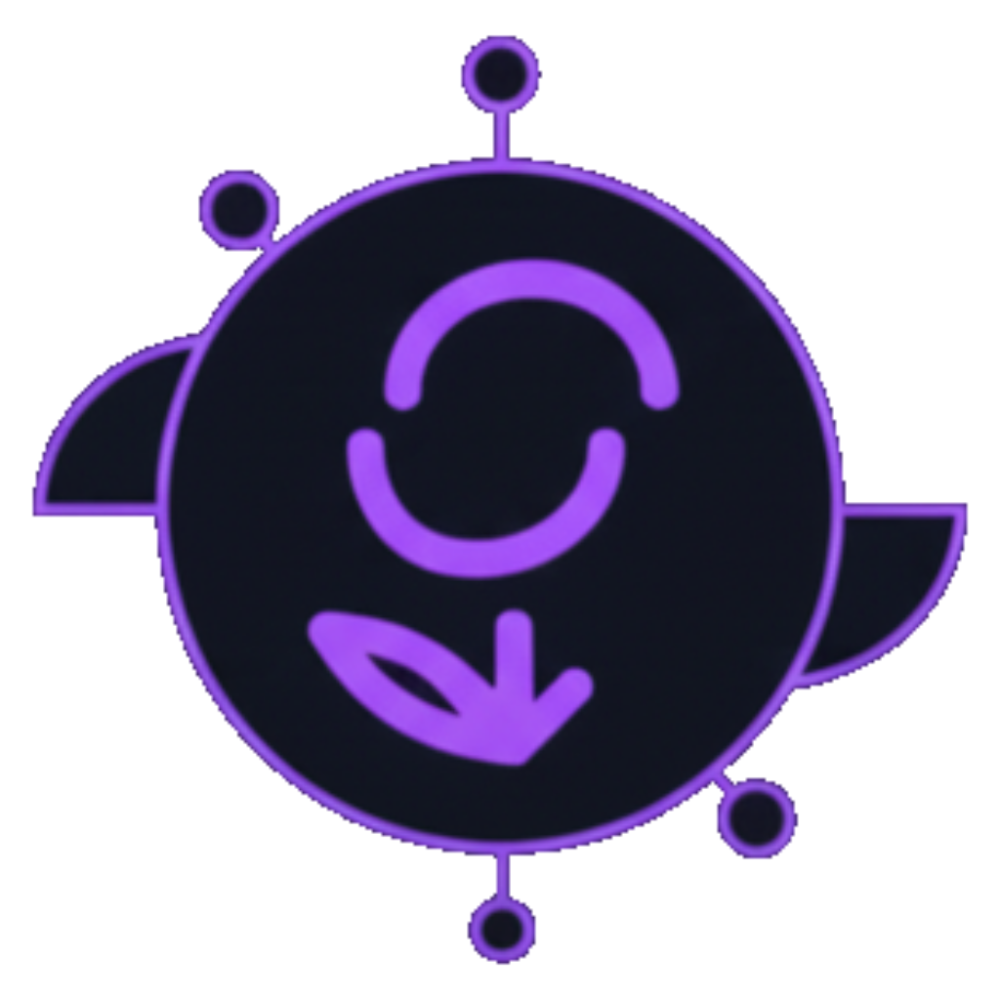

# NexoDev - Desenvolvimento Web de Alto Impacto



Site institucional da NexoDev, uma agência especializada em desenvolvimento web moderno, criação de interfaces UX/UI e soluções digitais de alta performance.

## 🚀 Tecnologias

- **React 19** - Biblioteca JavaScript para construção de interfaces
- **Vite** - Build tool e dev server ultra-rápido
- **Tailwind CSS v4** - Framework CSS utility-first
- **Lucide React** - Ícones modernos e otimizados

## 📋 Pré-requisitos

- Node.js 18+ 
- npm ou yarn

## 🔧 Instalação

```bash
# Clone o repositório
git clone https://github.com/seu-usuario/nexodev.git

# Entre na pasta do projeto
cd nexodev

# Instale as dependências
npm install
```

## 💻 Desenvolvimento

```bash
# Inicie o servidor de desenvolvimento
npm run dev
```

O site estará disponível em `http://localhost:5173`

## 🏗️ Build para Produção

```bash
# Gerar build otimizado
npm run build

# Preview do build
npm run preview
```

## 📁 Estrutura do Projeto

```
nexodev/
├── src/
│   ├── assets/          # Imagens e arquivos estáticos
│   ├── components/      # Componentes React
│   │   ├── common/      # Componentes reutilizáveis
│   │   ├── layout/      # Header, Footer
│   │   └── sections/    # Seções da página
│   ├── data/            # Dados e constantes
│   ├── pages/           # Páginas da aplicação
│   ├── App.jsx          # Componente principal
│   ├── main.jsx         # Entry point
│   └── index.css        # Estilos globais
├── public/              # Arquivos públicos
└── index.html           # HTML principal
```

## 🎨 Funcionalidades

- ✅ Design responsivo e moderno
- ✅ Navegação suave entre seções
- ✅ Chatbot interativo (NexoAI)
- ✅ Formulário de contato
- ✅ Seções:
  - Hero com CTA
  - Serviços
  - Stack Tecnológico
  - Sobre Nós
  - Processo de Trabalho
  - Portfólio
  - Depoimentos
  - Contato
- ✅ Modal para Política de Privacidade e Termos
- ✅ Integração com redes sociais

## 🎯 Seções do Site

### Hero
Apresentação principal com chamada para ação

### Serviços
- Desenvolvimento Web Personalizado
- Design UX/UI Estratégico
- Otimização de Performance (SEO/Velocidade)
- Suporte e Manutenção Contínua

### Tech Stack
Tecnologias utilizadas: Vue.js, React, Node.js, Tailwind CSS, TypeScript, Firebase/Supabase

### Processo
1. Descoberta e Estratégia
2. Design UX/UI
3. Desenvolvimento Ágil
4. Lançamento e Otimização

## 🤝 Contribuindo

Contribuições são bem-vindas! Sinta-se à vontade para abrir issues e pull requests.

## 📝 Licença

Este projeto está sob a licença MIT.

## 📧 Contato

- **Email**: contato@nexodev.com
- **LinkedIn**: [NexoDev](https://www.linkedin.com/company/nexodev)
- **GitHub**: [nexodev-agency](https://github.com/nexodev-agency)
- **Instagram**: [@nexodev](https://www.instagram.com/nexodev)

---

Desenvolvido com 💜 por NexoDev
